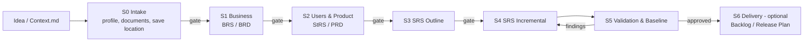
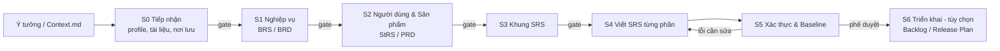

# 🛠️ Requirements Documentation Kit / Bộ Công Cụ Tài Liệu Yêu Cầu

[](https://www.iso.org/standard/72087.html)
[](https://ears.requirements.org/)
[]()
[]()

---

<details open>
<summary><b>🇺🇸 English Version</b></summary>

## Overview

The **Requirements Documentation Kit** is a standards-based framework for Agent-User requirements engineering. It guides you **step by step from a raw idea to a reviewed set of requirements documents**. You choose the documents per project:

| Layer | Documents | Basis |
| :--- | :--- | :--- |
| Business (why) | **BRS** and/or **BRD** | ISO/IEC/IEEE 29148:2018 (BRS); IIBA BABOK v3 (BRD) |
| Users & product (who needs what) | **StRS** and/or **PRD** (Lean or Standard) | ISO/IEC/IEEE 29148:2018 (StRS); product management practice (PRD) |
| Software (what it shall do) | **SRS** | ISO/IEC/IEEE 29148:2018 |
| Delivery (optional) | **Product Backlog**, **Release Plan** | Scrum Guide 2020, IIBA BABOK v3 |

BRD, PRD, backlog, and release plan are not defined by any ISO standard; the kit says so and grounds them in BABOK and widely published practice. The documents are tailored to the **Project Profile** (a personal project, a team project, or an SME / start-up) and to the **Tier** (technical complexity). The AI Agent asks whenever it is unsure instead of guessing, and uses EARS rules and a strict status pipeline to prevent requirement drift, ambiguity, and hallucination.

---

## Key Features

*   **Idea-to-Requirements Pipeline**: Stages with User-confirmed gates: Intake → Business (BRS/BRD) → Users & Product (StRS/PRD) → SRS Outline → SRS Incremental → Validation & Baseline → Delivery (optional).
*   **Choose Your Documents**: Pick BRS, BRD, StRS, PRD, SRS, Backlog, and Release Plan per project; the Agent recommends a set and never writes the same content twice.
*   **Lean Or Standard PRD**: The Agent asks the PRD scope, then whether you want user stories, a backlog, or a release plan; any "yes" gives a Standard PRD.
*   **You Choose Where Files Go**: The Agent asks where to save the documents; the default is `ProjectDocuments/<ProjectName>/`.
*   **Guided Discovery Interview**: The Agent asks 3-5 questions per turn from a standards-mapped question bank, so you don't need a finished brief to start.
*   **Ask-When-Uncertain**: Whenever input is ambiguous, the project size is unclear, or the Agent isn't sure what to do, it asks you, with options and a recommendation, instead of guessing. It never invents dates, estimates, or prices.
*   **Project Profiles × Tiers**: Governance (PERSONAL / TEAM / SME, inspired by ISO/IEC 29110) and complexity (Tier 1-3) are tailored independently.
*   **Standard-Compliant Architecture**: BRS, StRS, and SRS content per ISO/IEC/IEEE 29148:2018; NFRs classified by ISO/IEC 25010:2023; privacy review based on ISO/IEC 29100.
*   **EARS Syntax**: Clear, atomic "shall" statements that stay verifiable and unambiguous.
*   **Configurable Output Language**: Write documents in English, Vietnamese, or another language; IDs and statuses stay machine-readable.
*   **Built-in Validation**: Micro checks (each requirement), Macro checks (whole document, requirement set), and Discovery checks (BRS and StRS).
*   **End-to-End Traceability**: `Business Goal → Stakeholder Need / Feature / User Story → Software Requirement → Acceptance Criterion → Backlog Item → Release`.
*   **Resumable Work**: A per-project state file records the current stage, open questions, and the next step.

---

## Directory Structure

```text
Requirements Documentation Kit/
├── Agent/                          # AI Agent instructions & workflows
│   ├── 01-Core/                    # Core contracts, run modes, interaction rules, project profiles
│   ├── 02-Discovery/               # Idea intake, interview question bank, BRS/StRS/BRD/PRD rules (S0-S2)
│   ├── 03-SRS/                     # SRS writing, validation, change control, traceability (S3-S5)
│   ├── 04-Delivery/                # Optional backlog & release plan rules (S6)
│   └── AGENTS.md                   # Master Agent Directive (System Instruction)
├── Context/                        # Inputs and templates
│   ├── Context.md.example          # Structured Idea Intake form
│   ├── Project-State-Template.md   # Per-project progress tracker template
│   ├── BRS-Template.md             # Business Requirements Specification template
│   ├── StRS-Template.md            # Stakeholder Requirements Specification template
│   ├── BRD-Template.md             # Business Requirements Document template
│   ├── PRD-Template.md             # Product Requirements Document template (Lean / Standard)
│   ├── Backlog-Template.md         # Product Backlog template (optional)
│   ├── Release-Plan-Template.md    # Release Plan template (optional)
│   ├── SRS-TOC.md                  # Canonical SRS Table of Contents
│   └── SRS-Template.md             # SRS template
├── User/                          # Guides for Users
│   ├── About.md                # Concepts: BRS, StRS, SRS & kit conventions
│   └── Guide.md                # How to use the kit, profiles, prompts
└── ProjectDocuments/               # Default output (or any folder you choose)
    └── <ProjectName>/
        ├── 00-Project-State.md
        ├── 01-BRS.md / 01-BRD.md
        ├── 02-StRS.md / 02-PRD.md
        ├── 03-SRS.md
        ├── 04-Backlog.md / 04-Release-Plan.md   (optional)
        ├── Reports/
        └── Change-Requests/
```

| Directory | Description |
| :--- | :--- |
| **[`Agent/`](Agent/)** | Read-only system instructions for AI Agents. `AGENTS.md` is the master prompt. |
| **[`Context/`](Context/)** | Your idea intake and the document templates. |
| **[`User/`](User/)** | Explanatory documentation for Users. |
| **`ProjectDocuments/`** | Default output folder, one subfolder per project. You can choose another location; the Agent writes only there. |

---

## Pipeline & Run Modes

### Idea-to-Requirements Pipeline



Each gate is confirmed by you (or the approver for your profile). The Agent asks questions at every stage when something is unclear.

### Project Profiles

| Profile | Use When | Recommended Documents | Approver |
| :--- | :--- | :--- | :--- |
| **PERSONAL** | You build it alone | Lean PRD + SRS | You |
| **TEAM** | A group builds it (student project, hackathon, internal tool) | PRD + SRS, or BRS + StRS + SRS | Product Owner / Team Lead |
| **SME** | A business or start-up builds it | BRD + PRD + SRS (+ BRS/StRS if required), compliance review | Business Owner / Founder |

Recommendations only: the Agent asks you to confirm or change the set.

The **Tier** (1 small, 2 medium, 3 large or regulated) decides which SRS sections are required. If you are unsure of either, the Agent explains the options and asks.

### The 7 Run Modes

0.  **Discovery Mode**: Guided interview that turns the idea into the business and product documents you chose (Stages S0-S2). Default for new projects.
1.  **Draft / Outline Mode**: Generates the SRS skeleton tailored to profile and tier, then waits for confirmation.
2.  **Incremental Mode (Default once an SRS exists)**: Writes or edits the SRS section by section.
3.  **Audit / Validation Mode**: Read-only quality checks; produces reports without changing documents.
4.  **Change Request / Patch Mode**: Localized edits after impact analysis; formality depends on the profile.
5.  **Full Generation Mode**: Complete SRS generation, section by section, when explicitly requested.
6.  **Delivery Mode (optional)**: Builds a product backlog and/or release plan from the PRD and SRS, using only dates and estimates you provide.

---

## Writing Conventions

### EARS Requirement Syntax

| Pattern | Trigger Syntax | Example |
| :--- | :--- | :--- |
| **Ubiquitous** | `The [system] shall [action]...` | The system shall retain audit logs for 365 days. |
| **Event-driven** | `When [event], the [system] shall [action]...` | When the user submits valid credentials, the system shall create an authenticated session. |
| **State-driven** | `While [state], the [system] shall [action]...` | While an account is locked, the system shall reject password login attempts. |
| **Unwanted Behavior** | `If [trigger], then the [system] shall [action]...` | If payment authorization fails, then the system shall display the payment failure reason. |
| **Optional Feature** | `Where [feature is active], the [system] shall [action]...` | Where multi-factor authentication is enabled, the system shall require a verification code. |

Stakeholder requirements (StRS) describe needs, not solutions: *"The Customer shall be able to book an appointment outside opening hours."*

### Canonical Status Model

Requirements go through a strict lifecycle. **Only the User approver can set `APPROVED`.**

*   `DRAFT`: Created or revised by the Agent, not yet reviewed.
*   `REVIEW`: Under User review / waiting for decision.
*   `APPROVED`: Explicitly accepted by the approver for the profile.
*   `DEPRECATED`: Kept for historical audit but no longer active.

### ID Format

Each item is tracked using a unique identifier: `<TYPE>-<DOMAIN>-<NNN>`
*   `BG-GEN-001` (Business Goal, in the BRS)
*   `STR-BOOK-001` (Stakeholder Requirement, in the StRS or PRD)
*   `US-BOOK-001` (User Story, in the PRD or Backlog)
*   `FR-AUTH-001` (Functional Requirement - Authentication)
*   `NFR-PERF-001` (Non-Functional Requirement - Performance)
*   `BR-ORDER-001` (Business Rule - Ordering)
*   `UC-PAY-001` (Use Case - Payment)

---

## Getting Started

### 👥 For Users
1.  **Describe your idea**: Copy `Context/Context.md.example` to `Context/Context.md`. Only Section 1 (the idea) is required; the Agent will ask about the rest. (`Context.md` is ignored by Git to keep your data private.)
2.  **Start the Agent**:
    *   *Personal project*: `"Start a new PERSONAL project from Context/Context.md"`
    *   *Team project*: `"Start Discovery for our TEAM project 'LibraryHub'. The approver is our team lead."`
    *   *SME / start-up*: `"Start Discovery for an SME project from Context/Context.md. I need a BRD, a PRD with user stories, and an SRS."`
    *   *Resume*: `"Continue project LibraryHub"`
    *   *Audit*: `"Validate project LibraryHub and create a validation report"`
3.  **Answer, review, approve**: Answer the Agent's questions (including where to save the documents), review each document at its gate, and approve explicitly (for example, `"Approve BRD v0.3"`).

See [`User/Guide.md`](User/Guide.md) for profiles, tiers, language options, and more prompts.

### 🤖 For AI Agents
1.  Always read the Master Agent Directive in [`Agent/AGENTS.md`](Agent/AGENTS.md) upon bootstrapping.
2.  Find and read the project's `00-Project-State.md` first (default `ProjectDocuments/<ProjectName>/`), then follow the reading sequence in Section 3 of `AGENTS.md`.
3.  Ask whenever you are uncertain; never infer the profile, tier, language, document set, or save location, and never invent dates or estimates.
4.  Write only inside the confirmed output location and protect `APPROVED` content.

---

> [!TIP]
> **Pro Tip:** Run **Audit / Validation Mode** before baselining an SRS to guarantee zero unresolved TBDs, ID duplicates, or broken traceability links.

> [!NOTE]
> **Standards status:** BRS, StRS, and SRS follow ISO/IEC/IEEE 29148:2018. BRD, PRD, backlog, and release plan have no ISO standard; the kit bases them on IIBA BABOK v3, the Scrum Guide, and widely published product management practice. See [`User/Guide.md`](User/Guide.md) Section 16.

</details>

---

<details>
<summary><b>🇻🇳 Bản Tiếng Việt</b></summary>

## Tổng Quan

**Requirements Documentation Kit** là bộ công cụ chuẩn hóa cho quy trình kỹ nghệ yêu cầu có sự phối hợp giữa con người (User) và AI (Agent). Bộ công cụ dẫn bạn **từng bước, từ một ý tưởng thô đến một bộ tài liệu yêu cầu đã được rà soát**. Bạn tự chọn những tài liệu cần cho từng dự án:

| Tầng | Tài liệu | Cơ sở |
| :--- | :--- | :--- |
| Nghiệp vụ (vì sao) | **BRS** và/hoặc **BRD** | ISO/IEC/IEEE 29148:2018 (BRS); IIBA BABOK v3 (BRD) |
| Người dùng & sản phẩm (ai cần gì) | **StRS** và/hoặc **PRD** (Lean hoặc Standard) | ISO/IEC/IEEE 29148:2018 (StRS); thực hành product management (PRD) |
| Phần mềm (phải làm gì) | **SRS** | ISO/IEC/IEEE 29148:2018 |
| Triển khai (tùy chọn) | **Product Backlog**, **Release Plan** | Scrum Guide 2020, IIBA BABOK v3 |

BRD, PRD, backlog và release plan không có tiêu chuẩn ISO nào định nghĩa. Kit nói rõ điều này và dựa chúng trên BABOK cùng các thực hành phổ biến. Các tài liệu được điều chỉnh theo **Project Profile** (dự án cá nhân, dự án nhóm, hay SME / startup) và theo **Tier** (độ phức tạp kỹ thuật). AI Agent sẽ hỏi bạn mỗi khi chưa chắc chắn thay vì tự đoán. Agent dùng quy tắc EARS và quy trình trạng thái chặt chẽ để ngăn yêu cầu bị trôi lệch, mơ hồ hoặc bịa đặt (hallucination).

---

## Tính Năng Nổi Bật

*   **Quy trình từ ý tưởng đến bộ tài liệu yêu cầu**: Các bước có cổng (gate) do con người xác nhận: Intake → Nghiệp vụ (BRS/BRD) → Người dùng & Sản phẩm (StRS/PRD) → Khung SRS → Viết SRS từng phần → Xác thực & Chốt baseline → Triển khai (tùy chọn).
*   **Tự chọn bộ tài liệu**: Chọn BRS, BRD, StRS, PRD, SRS, Backlog, Release Plan cho từng dự án. Agent gợi ý một bộ và không bao giờ viết cùng một nội dung hai lần.
*   **PRD Lean hoặc Standard**: Agent hỏi phạm vi PRD, sau đó hỏi bạn có muốn user stories, backlog hay release plan không. Chỉ cần một câu "có" là làm Standard PRD.
*   **Bạn chọn nơi lưu file**: Agent hỏi bạn muốn lưu tài liệu ở đâu; mặc định là `ProjectDocuments/<ProjectName>/`.
*   **Phỏng vấn khám phá có hướng dẫn**: Mỗi lượt Agent hỏi 3-5 câu, lấy từ bộ câu hỏi đã ánh xạ theo tiêu chuẩn. Bạn không cần có sẵn tài liệu mô tả hoàn chỉnh mới bắt đầu được.
*   **Không chắc thì hỏi (Ask-When-Uncertain)**: Khi đầu vào mơ hồ, chưa rõ quy mô dự án, hoặc Agent không biết làm gì tiếp, Agent sẽ hỏi bạn kèm các lựa chọn và đề xuất, thay vì tự đoán. Agent không bao giờ tự đặt ngày, ước lượng hay giá.
*   **Project Profile × Tier**: Mức quản trị (PERSONAL / TEAM / SME, dựa trên tinh thần ISO/IEC 29110) và độ phức tạp (Tier 1-3) được điều chỉnh độc lập với nhau.
*   **Kiến trúc chuẩn hóa**: Nội dung BRS, StRS, SRS theo ISO/IEC/IEEE 29148:2018; yêu cầu phi chức năng phân loại theo ISO/IEC 25010:2023; rà soát quyền riêng tư dựa trên ISO/IEC 29100.
*   **Cú pháp EARS**: Câu yêu cầu "phải" (shall) rõ ràng, đơn nhất, kiểm chứng được.
*   **Chọn ngôn ngữ đầu ra**: Viết tài liệu bằng tiếng Anh, tiếng Việt hoặc ngôn ngữ khác. ID và trạng thái vẫn giữ dạng máy đọc được.
*   **Xác thực tích hợp**: Kiểm tra Micro (từng yêu cầu), Macro (toàn tài liệu và tập yêu cầu) và kiểm tra Discovery (BRS và StRS).
*   **Truy vết xuyên suốt**: `Mục tiêu nghiệp vụ → Nhu cầu / Tính năng / User Story → Yêu cầu phần mềm → Tiêu chí chấp nhận → Backlog → Release`.
*   **Làm tiếp được bất cứ lúc nào**: Mỗi dự án có file trạng thái ghi lại bước hiện tại, các câu hỏi còn mở và bước tiếp theo.

---

## Cấu Trúc Thư Mục

```text
Requirements Documentation Kit/
├── Agent/                          # Hướng dẫn & quy trình cho AI Agent
│   ├── 01-Core/                    # Quy tắc cốt lõi, chế độ vận hành, tương tác, project profile
│   ├── 02-Discovery/               # Tiếp nhận ý tưởng, bộ câu hỏi phỏng vấn, quy tắc BRS/StRS/BRD/PRD (S0-S2)
│   ├── 03-SRS/                     # Viết SRS, xác thực, kiểm soát thay đổi, truy vết (S3-S5)
│   ├── 04-Delivery/                # Quy tắc backlog & release plan, tùy chọn (S6)
│   └── AGENTS.md                   # Chỉ thị Master Agent (System Instruction)
├── Context/                        # Đầu vào và biểu mẫu
│   ├── Context.md.example          # Mẫu tiếp nhận ý tưởng có cấu trúc
│   ├── Project-State-Template.md   # Mẫu file theo dõi tiến độ dự án
│   ├── BRS-Template.md             # Mẫu đặc tả yêu cầu nghiệp vụ
│   ├── StRS-Template.md            # Mẫu đặc tả yêu cầu của bên liên quan
│   ├── BRD-Template.md             # Mẫu tài liệu yêu cầu nghiệp vụ (BRD)
│   ├── PRD-Template.md             # Mẫu tài liệu yêu cầu sản phẩm (Lean / Standard)
│   ├── Backlog-Template.md         # Mẫu Product Backlog (tùy chọn)
│   ├── Release-Plan-Template.md    # Mẫu Release Plan (tùy chọn)
│   ├── SRS-TOC.md                  # Mục lục SRS chuẩn
│   └── SRS-Template.md             # Mẫu SRS
├── User/                          # Tài liệu hướng dẫn cho con người
│   ├── About.md                # Khái niệm: BRS, StRS, SRS & quy ước
│   └── Guide.md                # Cách dùng, profile, câu lệnh mẫu
└── ProjectDocuments/               # Đầu ra mặc định (hoặc thư mục bạn chọn)
    └── <ProjectName>/
        ├── 00-Project-State.md
        ├── 01-BRS.md / 01-BRD.md
        ├── 02-StRS.md / 02-PRD.md
        ├── 03-SRS.md
        ├── 04-Backlog.md / 04-Release-Plan.md   (tùy chọn)
        ├── Reports/
        └── Change-Requests/
```

| Thư mục | Mô tả |
| :--- | :--- |
| **[`Agent/`](Agent/)** | Chỉ thị hệ thống (chỉ đọc) cho AI Agent. `AGENTS.md` là system prompt chính. |
| **[`Context/`](Context/)** | Mô tả ý tưởng của bạn và các biểu mẫu tài liệu. |
| **[`User/`](User/)** | Tài liệu giải thích dành cho con người. |
| **`ProjectDocuments/`** | Thư mục đầu ra mặc định, mỗi dự án một thư mục con. Bạn có thể chọn nơi khác; Agent chỉ ghi vào đó. |

---

## Quy Trình & Các Chế Độ Vận Hành

### Quy trình từ ý tưởng đến bộ tài liệu yêu cầu



Mỗi cổng (gate) do bạn hoặc người phê duyệt của profile xác nhận. Ở mọi bước, Agent sẽ hỏi khi có điều chưa rõ.

### Project Profile

| Profile | Khi nào dùng | Bộ tài liệu gợi ý | Người phê duyệt |
| :--- | :--- | :--- | :--- |
| **PERSONAL** | Bạn tự làm một mình | Lean PRD + SRS | Chính bạn |
| **TEAM** | Một nhóm cùng làm (đồ án, hackathon, công cụ nội bộ) | PRD + SRS, hoặc BRS + StRS + SRS | Product Owner / Trưởng nhóm |
| **SME** | Doanh nghiệp hoặc startup làm sản phẩm | BRD + PRD + SRS (+ BRS/StRS nếu được yêu cầu), rà soát tuân thủ | Chủ doanh nghiệp / Founder |

Đây chỉ là gợi ý: Agent sẽ hỏi bạn xác nhận hoặc thay đổi bộ tài liệu.

**Tier** (1 nhỏ, 2 trung bình, 3 lớn hoặc có ràng buộc pháp lý) quyết định những phần SRS nào là bắt buộc. Nếu bạn chưa chắc về profile hay tier, Agent sẽ giải thích các lựa chọn và hỏi bạn.

### 7 Chế Độ Vận Hành

0.  **Discovery Mode (Khám phá)**: Phỏng vấn có hướng dẫn để biến ý tưởng thành các tài liệu nghiệp vụ và sản phẩm bạn đã chọn (bước S0-S2). Là chế độ mặc định khi bắt đầu dự án mới.
1.  **Draft / Outline Mode (Phác thảo)**: Tạo khung SRS theo profile và tier, rồi chờ bạn xác nhận.
2.  **Incremental Mode (Viết tăng dần, mặc định khi đã có SRS)**: Viết hoặc sửa SRS theo từng phần.
3.  **Audit / Validation Mode (Kiểm tra)**: Chỉ đọc; kiểm tra chất lượng và tạo báo cáo mà không sửa tài liệu.
4.  **Change Request / Patch Mode (Thay đổi)**: Sửa cục bộ sau khi phân tích tác động. Mức độ chặt chẽ tùy theo profile.
5.  **Full Generation Mode (Tạo toàn bộ)**: Tạo toàn bộ SRS theo từng phần, chỉ khi được yêu cầu rõ ràng.
6.  **Delivery Mode (Triển khai, tùy chọn)**: Lập product backlog và/hoặc release plan từ PRD và SRS, chỉ dùng ngày và ước lượng do bạn cung cấp.

---

## Quy Ước Viết Yêu Cầu

### Cú Pháp EARS

Với tiếng Việt, từ khóa bắt buộc là **"phải"** (tương đương *shall*). Không dùng "sẽ", vì "sẽ" chỉ tương đương *will* và mang nghĩa yếu hơn.

| Dạng yêu cầu | Cú pháp | Ví dụ |
| :--- | :--- | :--- |
| **Ubiquitous**<br>*(Luôn áp dụng)* | `Hệ thống phải [hành động]...` | Hệ thống phải lưu nhật ký kiểm toán trong 365 ngày. |
| **Event-driven**<br>*(Theo sự kiện)* | `Khi [sự kiện], hệ thống phải [hành động]...` | Khi người dùng gửi thông tin đăng nhập hợp lệ, hệ thống phải tạo một phiên đã xác thực. |
| **State-driven**<br>*(Theo trạng thái)* | `Trong khi [trạng thái], hệ thống phải [hành động]...` | Trong khi tài khoản bị khóa, hệ thống phải từ chối các lần đăng nhập bằng mật khẩu. |
| **Unwanted Behavior**<br>*(Xử lý lỗi/ngoại lệ)* | `Nếu [điều kiện], thì hệ thống phải [hành động]...` | Nếu xác thực thanh toán thất bại, thì hệ thống phải hiển thị lý do thất bại. |
| **Optional Feature**<br>*(Tính năng tùy chọn)* | `Ở nơi [tính năng được bật], hệ thống phải [hành động]...` | Ở nơi xác thực đa yếu tố được bật, hệ thống phải yêu cầu mã xác minh. |

Yêu cầu của bên liên quan (StRS) mô tả nhu cầu, không mô tả giải pháp: *"Khách hàng phải có thể đặt lịch hẹn ngoài giờ mở cửa."*

### Mô Hình Trạng Thái Yêu Cầu

**Chỉ người phê duyệt (con người) mới được đặt trạng thái `APPROVED`.**

*   `DRAFT`: Agent tạo mới hoặc vừa sửa, chưa được rà soát.
*   `REVIEW`: Đang chờ con người rà soát hoặc ra quyết định.
*   `APPROVED`: Được người phê duyệt của profile chấp thuận chính thức.
*   `DEPRECATED`: Giữ lại để đối chiếu lịch sử nhưng không còn hiệu lực.

### Định Dạng Mã (ID)

Mỗi mục được theo dõi bằng mã duy nhất: `<TYPE>-<DOMAIN>-<NNN>`
*   `BG-GEN-001` (Mục tiêu nghiệp vụ, trong BRS)
*   `STR-BOOK-001` (Yêu cầu của bên liên quan, trong StRS hoặc PRD)
*   `US-BOOK-001` (User Story, trong PRD hoặc Backlog)
*   `FR-AUTH-001` (Yêu cầu chức năng - Xác thực)
*   `NFR-PERF-001` (Yêu cầu phi chức năng - Hiệu năng)
*   `BR-ORDER-001` (Quy tắc nghiệp vụ - Đặt hàng)
*   `UC-PAY-001` (Use Case - Thanh toán)

---

## Hướng Dẫn Bắt Đầu

### 👥 Dành cho Người dùng
1.  **Mô tả ý tưởng**: Sao chép `Context/Context.md.example` thành `Context/Context.md`. Bạn chỉ cần điền Mục 1 (ý tưởng); phần còn lại Agent sẽ hỏi dần. (`Context.md` được Git bỏ qua để giữ riêng tư dữ liệu của bạn.)
2.  **Khởi động Agent**:
    *   *Dự án cá nhân*: `"Start a new PERSONAL project from Context/Context.md. Write documents in Vietnamese."`
    *   *Dự án nhóm*: `"Start Discovery for our TEAM project 'LibraryHub'. The approver is our team lead."`
    *   *SME / startup*: `"Start Discovery for an SME project from Context/Context.md. I need a BRD, a PRD with user stories, and an SRS."`
    *   *Làm tiếp*: `"Continue project LibraryHub"`
    *   *Kiểm tra*: `"Validate project LibraryHub and create a validation report"`
3.  **Trả lời, rà soát, phê duyệt**: Trả lời câu hỏi của Agent (kể cả nơi lưu tài liệu), rà soát từng tài liệu ở mỗi cổng, và phê duyệt một cách rõ ràng (ví dụ: `"Approve BRD v0.3"`).

Xem [`User/Guide.md`](User/Guide.md) để biết thêm về profile, tier, ngôn ngữ và các câu lệnh mẫu khác.

### 🤖 Dành cho AI Agent
1.  Luôn đọc Master Agent Directive trong [`Agent/AGENTS.md`](Agent/AGENTS.md) khi bắt đầu phiên làm việc.
2.  Tìm và đọc `00-Project-State.md` của dự án trước (mặc định trong `ProjectDocuments/<ProjectName>/`), sau đó làm theo thứ tự đọc ở Mục 3 của `AGENTS.md`.
3.  Hỏi mỗi khi chưa chắc chắn; không bao giờ tự suy ra profile, tier, ngôn ngữ, bộ tài liệu hay nơi lưu, và không bao giờ tự đặt ngày hay ước lượng.
4.  Chỉ ghi trong thư mục đầu ra đã được xác nhận và bảo vệ nội dung đã `APPROVED`.

---

> [!TIP]
> **Mẹo:** Chạy **Audit / Validation Mode** trước khi chốt baseline SRS để đảm bảo không còn TBD chưa xử lý, không trùng ID và không đứt liên kết truy vết.

> [!NOTE]
> **Tình trạng tiêu chuẩn:** BRS, StRS và SRS theo ISO/IEC/IEEE 29148:2018. BRD, PRD, backlog và release plan không có tiêu chuẩn ISO; kit dựa chúng trên IIBA BABOK v3, Scrum Guide và các thực hành product management phổ biến. Xem [`User/Guide.md`](User/Guide.md) Mục 16.

</details>

---
